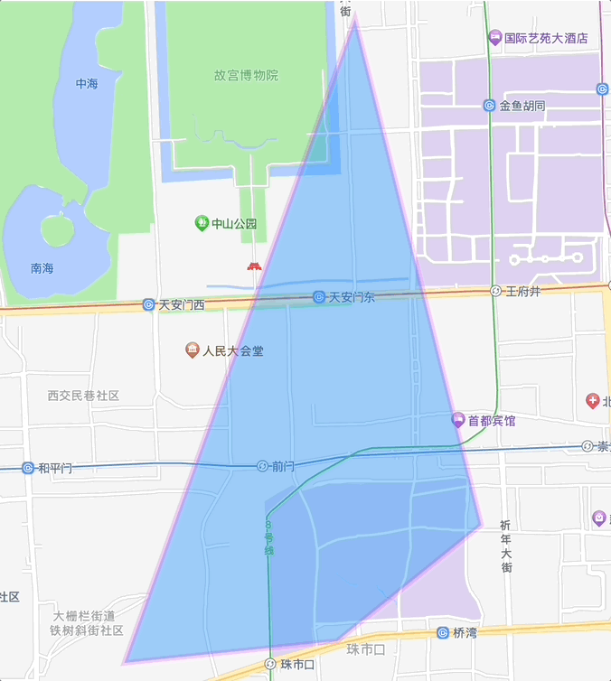
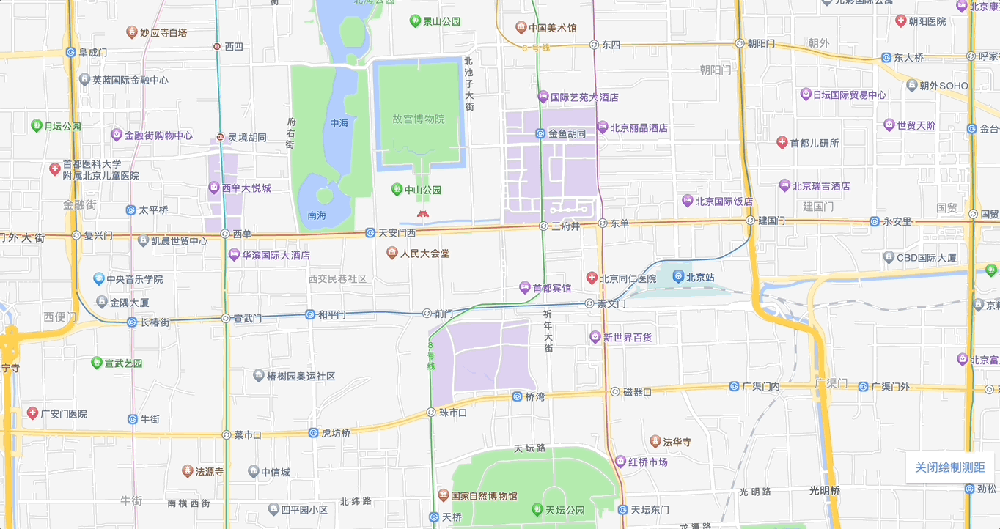
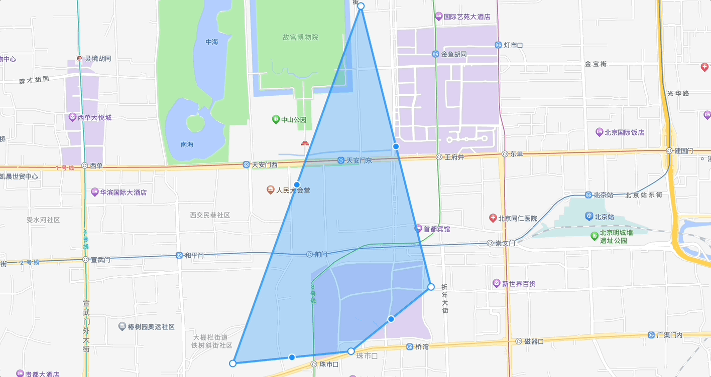
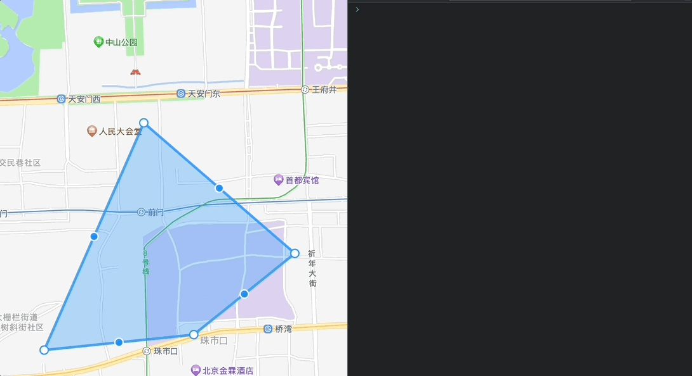

# 高德未支持工具封装

## 安装

```shell
npm install gaode-tools
```

## 使用

```js
import gaodeTools from 'gaode-tools';

const polygonRangingIns = new gaodeTools.PolygonRanging(map);

// 或者
import { PolygonRanging } from 'gaode-tools';

const polygonRangingIns = new PolygonRanging(map);
```

## 本地运行

```shell
npm install

npm run dev
```

## 通用 API

| 参数 | 说明 | 类型 |
| ----- | ----- | ---- |
| `start` | 启用相应能力 | `instance.start(arg?)` |
| `stop` | 停止相应能力 | `instance.stop()` |
| `destroy` | 销毁相应能力 | `instance.destroy()` |

## 多边形类工具

### 多边形测距 PolygonRanging

**示例**

```javascript
import { PolygonRanging } from 'gaode-tools';

const map = new AMap.Map('container');
const polygonRangingIns = new PolygonRanging(map);

const polygon = new AMap.Polygon({});

// 开启测距
polygonRangingIns.start(polygon);

// 适当时机销毁测距（如组件的 destroy 生命周期）
polygonRangingIns.destroy();
```



### 多边形绘制时测距 PolygonRangingInDrawing

**示例**

```javascript
import { PolygonRangingInDrawing } from 'gaode-tools';

const map = new AMap.Map('container');
const polygonRangingIns = new PolygonRangingInDrawing(map);

const mouseTool = new AMap.MouseTool({});

mouseTool.on('draw', () => {
    // 绘制完成后，需要停止
    polygonRangingIns.stop();
});

// 开始绘制多边形
mouseTool.polygon();

// 开启测距
polygonRangingIns.start();

// 适当时机销毁测距（如组件的 destroy 生命周期）
polygonRangingIns.destroy();
```



### 多边形编辑器测距 PolygonEditorRanging

**示例**

```javascript
import { PolygonEditorRanging } from 'gaode-tools';

const map = new AMap.Map('container');

const polygon = new AMap.Polygon({});

const editor = new AMap.PolygonEditor(map, polygon);

const polygonEditorRangingIns = new PolygonEditorRanging(map);

// 开启测距
polygonEditorRangingIns.start(editor);

// 适当时机停止测距
polygonEditorRangingIns.stop();

// 适当时机销毁测距（如组件的 destroy 生命周期）
polygonEditorRangingIns.destroy();
```



### 多边形编辑器操作点事件

**示例**

```javascript
import { PolygonEditorEvent } from 'gaode-tools';

const map = new AMap.Map('container');

const polygon = new AMap.Polygon({});

const editor = new AMap.PolygonEditor(map, polygon);
editor.open();

const polygonEditorEventIns = new PolygonEditorEvent(editor);

polygonEditorEventIns.on('mousedown', (target) => {
    console.log('当前鼠标按下点位', target);
});

polygonEditorEventIns.on('mousemove', (target) => {
    console.log('当前移动点位', target);
});

polygonEditorEventIns.on('mouseup', (target) => {
    console.log('当前鼠标松开点位', target);
});

// 适当时机销毁测距（如组件的 destroy 生命周期）
polygonEditorEventIns.clearAll();
```



**API**

|  参数 | 说明 | 类型 |
| ----- | ----- | ---- |
| on | 监听指定事件 | `on(eventName: mousedown \| mousemove \| mouseup, callback: (target: AMap.CircleMarker) => void)` |
| off | 移除指定事件 | `off(eventName: mousedown \| mousemove \| mouseup, callback: (target: AMap.CircleMarker) => void)` |
| once | 监听指定事件行为，触发一次后自动移除 | `once(eventName: mousedown \| mousemove \| mouseup, callback: (target: AMap.CircleMarker) => void)` |
| clearAll | 移除指定事件监听，`eventName` 不传则移除全部 | `clearAll(eventName?: mousedown \| mousemove \| mouseup)` |
